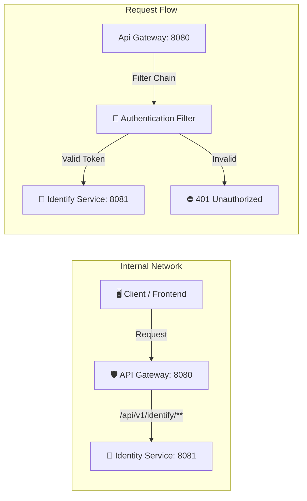

# 🌐 API Gateway Service


> Đây là công vào duy nhất (Entry Point) của toàn hệ thống. Với nhiệm vụ điều hướng request , xác thực token (AuthenticateGatewayFilter) trước khi request đến các microservices phía sau.

## 📑 Mục lục
- [Kiến trúc định tuyến](#kiến-trúc-định-tuyến)
- [Tính năng Gateway](#tính-năng-gateway)
- [Cấu hình Routes](#cấu-hình-routes)
- [Yêu cầu Request](#yêu-cầu-request)
- [Cài đặt & Chạy](#cài-đặt--chạy)


## Kiến trúc định tuyến

Hệ thống sử dụng **Spring Cloud Gateway** đóng vai trò là điểm truy cập duy nhất (Single Entry Point) cho toàn bộ hệ thống Microservices. Mọi yêu cầu từ Client đều được định tuyến qua Gateway để đảm bảo tính bảo mật và thống nhất.

### Workflow



## Tính năng Gateway

- [x] **Centralized Routing**: định tuyến toàn bộ request đều phải đi qua Api Gateway.
- [x] **Authentication Filter**: Bộ lọc kiểm tra tính hợp lệ của toàn bộ request trước khi đi vào hệ thông nội bộ. Bộ lọc sẽ kiểm tra endpoint có phải là public endpoint không, nếu không phải là public endpoint thì sẽ thực hiện authenticate trước khi cấp quyền cho request đi vào.
- [ ] **CORS Configuration:** Cấu hình chuẩn để Frontend (React/Vue) giao tiếp không bị chặn.
- [ ] **Load Balancing:** (Optional) Cân bằng tải Client-side.

## Cấu hình Routes

### Bảng định tuyến Route
| Tên Service | Public Endpoint (Gọi vào Gateway) | Target Port (Local) | Mô tả |
| :--- | :--- | :--- | :--- |
| Identify | `/api/v1/identify/**` | 8081 | Đăng nhập, Đăng kí tài khoản |
|  |  |  |  |

> **⚠️ Lưu ý:** Frontend chỉ được phép gọi vào port của Gateway (Mặc định: **http://localhost:8080**). Tuyệt đối không gọi trực tiếp vào các port **8081**, **8082** ...

### Cấu hình Java (Configuration)
```java
    @Configuration
    public class GatewayConfig {
        public final AuthenticationGatewayFilterFactory authenticationFilter;
    
        public GatewayConfig(AuthenticationGatewayFilterFactory authenticationFilter){
            this.authenticationFilter = authenticationFilter;
        }
    
        @Bean
        public RouteLocator customLocator(RouteLocatorBuilder builder){
            return builder.routes()
                    // identify service
                    .route("identify", r -> r
                            .path("/api/v1/identify/**")
                            .filters(f -> f
                                    .stripPrefix(3)
                                    .filter(authenticationFilter.apply(new AuthenticationGatewayFilterFactory.Config()))
                            )
                            .uri("http://localhost:8081"))
                    .build();
        }
    }
```

## Yêu cầu request

Để đảm bảo tính bảo mật, API Gateway áp dụng các quy tắc nghiêm ngặt về xác thực và định dạng dữ liệu.

### 1. Cơ chế Xác thực (Authentication)

Hệ thống sử dụng **JWT (JSON Web Token)** được lưu trữ trong **HttpOnly Cookie** để xác thực người dùng.

* **Loại Token:** `access_token` và `refresh_token`.
* **Cơ chế gửi:** Tự động gửi qua Cookie (Browser) hoặc Header (Mobile/Postman).

#### A. Đối với Web App (React/Vue/Angular)
Frontend **không cần** thủ công đính kèm token vào Header. Trình duyệt sẽ tự động làm việc này nếu bạn cấu hình đúng:

* **Yêu cầu:** Bắt buộc bật chế độ gửi credentials trong HTTP Client.
    * **Axios:** `withCredentials: true`
    * **Fetch API:** `credentials: 'include'`

> **⚠️ Lưu ý:** Nếu thiếu cấu hình trên, Cookie sẽ không được gửi đi và Gateway sẽ trả về lỗi `401 Unauthorized`.

#### B. Đối với Postman
Nếu client không hỗ trợ Cookie tự động, bạn cần gửi Token thủ công qua Header:

* Gateway hỗ trợ Bearer Header*:
* **Key:** `Authorization`
* **Value:** `Bearer <your_jwt_token>`

---

### 2. Headers Bắt buộc (Common Headers)
Trừ các API upload file, tất cả các request khác đều phải có header định dạng dữ liệu:

| Key | Value | Mô tả |
| :--- | :--- | :--- |
| `Content-Type` | `application/json` | Định dạng dữ liệu gửi lên là JSON |
| `Accept` | `application/json` | Mong muốn nhận phản hồi là JSON |

---

### 3. Các mã lỗi thường gặp (Common HTTP Status)
Khi gọi qua Gateway, bạn có thể gặp các mã lỗi sau liên quan đến request:

| Code | Ý nghĩa | Nguyên nhân & Cách khắc phục |
| :--- | :--- | :--- |
| **200** | OK | Thành công. |
| **400** | Bad Request | Dữ liệu gửi lên sai định dạng hoặc thiếu trường bắt buộc. |
| **401** | Unauthorized | **Chưa đăng nhập** hoặc **Token hết hạn/không hợp lệ**. <br>👉 *Action:* Redirect về trang Login hoặc gọi API Refresh Token. |
| **403** | Forbidden | **Không có quyền truy cập**. (Ví dụ: User thường cố gọi API của Admin). |
| **502** | Bad Gateway | Service con (Identity/User/Product) đang bị sập hoặc không kết nối được. |

---

## Cài đặt & Chạy

Bạn có thể chạy dự án theo 2 cách: Chạy trực tiếp (cho Dev) hoặc chạy bằng Docker Compose (cho môi trường tích hợp).

### 📋 Yêu cầu hệ thống (Prerequisites)
- **Java:** JDK 21 trở lên.
- **Gradle:** 9.2.1.
- **Database:** PostgreSQL latest version.
---

### 🚀 Chạy thủ công (Local Development)

Để phát triển Gateway, bạn cần đảm bảo các **Service con (Identity, User...) đã được khởi động trước**.

#### Bước 1: Clone dự án
```bash
git clone [https://github.com/HarryDo29/api-gateway.git](https://github.com/HarryDo29/api-gateway.git)
cd api-gateway
```

#### Bước 2: Chạy app
** Windows **
```bash
gradlew.bat bootRun
```

** MacOS/Linux **
```bash
./gradlew bootRun
```

Gateway sẽ khởi động tại: `http://localhost:8080`
