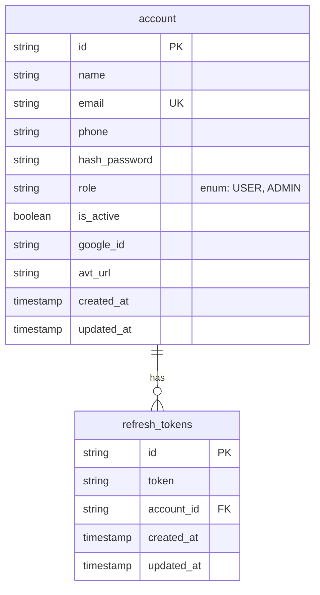

# 👤 Identity Service


> Service chịu trách nhiệm cốt lõi về **Xác thực (Authentication)** và **Phân quyền (Authorization)**. Quản lý toàn bộ vòng đời của Account, Role, Permission và phát hành Token (JWT).

## 📑 Mục lục
- [Tính năng](#tính-năng)
- [Mô hình dữ liệu](#mô-hình-dữ-liệu)
- [Biến môi trường](#biến-môi-trường-quan-trọng)
- [Danh sách API](#danh-sách-api-chính)
- [Cài đặt & Chạy](#cài-đặt--chạy)

## 🚀 Tính năng

- [x] **User Management**: Đăng ký, cập nhật profile, quản lý danh sách người dùng.
- [x] **Authentication**: Đăng nhập (Email/Password), Đăng nhập Google (OAuth2).
- [x] **Token Management**:
    - Cấp phát Access Token & Refresh Token.
    - Cơ chế **Token Rotation** để bảo mật.
- [x] **Authorization (RBAC)**: Phân quyền dựa trên Role (Admin, User) và Permission cụ thể.

## 🗄️ Mô hình dữ liệu

Hệ thống sử dụng **PostgreSQL** với kiến trúc **Role-Based Access Control (RBAC)**.



## Biến môi trường

Các biến cấu hình quan trọng cần được thiết lập trong file `secret.properties` hoặc biến môi trường hệ thống.

| Tên biến (Key)         | Mô tả                                       | Giá trị mẫu (Example)                             |
|:-----------------------|:--------------------------------------------|:--------------------------------------------------|
| `host`                 | tên miền                                    | `localhost`                                       |
| **DATABASE**           |                                             |                                                   |
| `postgres.username`    | Tên đăng nhập DB                            | `postgres`                                        |
| `postgres.password`    | Mật khẩu DB                                 | `admin123`                                        |
| `postgres.port`        | Database chạy ở port                        | `5432`                                            |
| `postgres.image`       | Image của database                          | `postgres`                                        |
| **SECURITY (JWT)**     |                                             |                                                   |
| `access-token.secret`  | Khóa bí mật dùng để ký access_token (HS512) | `MySuperSecretKey_Must_Be_At_Least_32_Chars_Long` |
| `access-token.expire`  | Thời gian sống access token (giây)          | `60*15` (15 phút)                                 |
| `refresh-token.secret` | Khóa bí mật dùng để ký refresh_token        | `MySuperSecretKey_Must_Be_At_Least_32_Chars_Long` |
| `refresh-token.expire` | Thời gian sống refresh token (giây)         | `30*60*60` (30 ngày)                              |
| **OAUTH2 (GOOGLE)**    |                                             |                                                   |
| `google.clientid`      | Client ID từ Google Console                 | `123...apps.googleusercontent.com`                |
| `google.secret`        | Client Secret từ Google Console             | `GOCSPX-...`                                      |

> ⚠️ **Lưu ý:** Tuyệt đối không commit file `secret.roperties` lên GitHub.

## Danh sách API

Service chạy mặc định tại port: `8081`.

### Nhóm xác thực (Authentication)
| Method | Endpoint                      | Mô tả                                  | Yêu cầu Auth |
| :--- |:------------------------------|:-----------------------------------------| :-- |
| `POST` | `/auth/login`                 | Đăng nhập (Email/Pass) lấy Token       | ❌ |
| `POST` | `/auth/register`              | Đăng kí tài khoảng mới.                | ❌ |
| `POST` | `/auth/logout`                | Đăng xuất (Hủy Token)                  | ✅ |
| `POST` | `/refresh_token`              | Lấy Access Token mới từ Refresh Token  | ✅ |
| `POST` | `/oauth2/authorization/google`| Đăng nhập bằng Google                  | ❌ |

### Nhóm người dùng (Account)
| Method | Endpoint                       | Mô tả                                    | Yêu cầu Auth |
|:-------|:-------------------------------|:-----------------------------------------|:-------------|
| `POST` | `/account`                     | Đăng ký tài khoản mới                    | ✅ (Admin)   |
| `GET`  | `/users`                       | Lấy danh sách tất cả user                | ✅ (Admin)   |
| `GET`  | `/users/{account_id}`          | Lấy thông tin chính mình bằng account id | ✅           |
| `GET`  | `/users/{email}`               | Lấy thông tin chính mình bằng email      | ✅           |
| `PUT`  | `/users/{account_id}`          | Cấp nhật lại thông tin cá nhân           | ✅           |
| `POST` | `/users/change-password`       | Cấp nhật lại thông tin cá nhân           | ✅           |

## Cài đặt & Chạy

Bạn có thể chạy dự án theo 2 cách: Chạy trực tiếp (cho Dev) hoặc chạy bằng Docker Compose (cho môi trường tích hợp).

### 📋 Yêu cầu hệ thống (Prerequisites)
- **Java:** JDK 21 trở lên.
- **Gradle:** 9.2.1.
- **Database:** PostgreSQL latest version.
---

### 🚀 Chạy thủ công (Local Development)

Để phát triển Gateway, bạn cần đảm bảo các **Service con (Identity, User...) đã được khởi động trước**.

#### Bước 1: Clone dự án
```bash
git clone [https://github.com/HarryDo29/api-gateway.git](https://github.com/HarryDo29/api-gateway.git)
cd api-gateway
```

#### Bước 2: Chạy app
** Windows **
```bash
gradlew.bat bootRun
```

** MacOS/Linux **
```bash
./gradlew bootRun
```

Identify Service sẽ khởi động tại: `http://localhost:8081`
